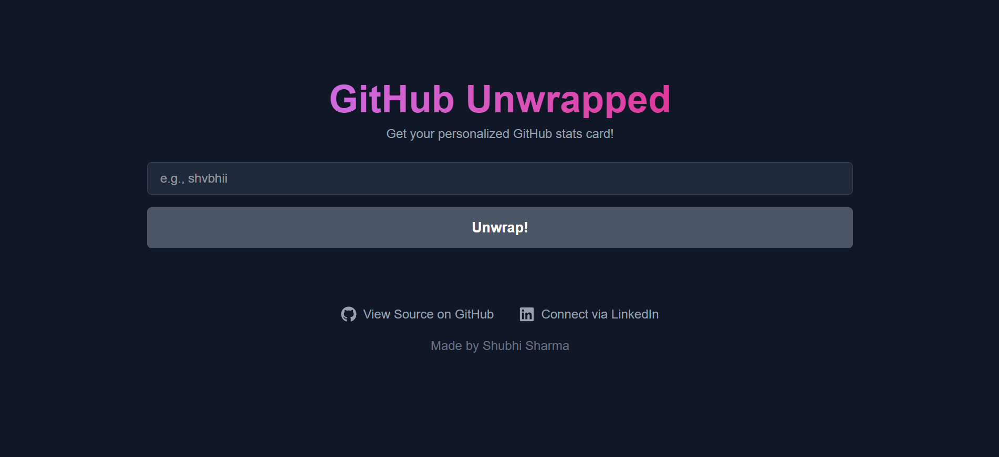

# GitHub Unwrapped 


.png)
*(A dynamic web app to generate a beautiful, shareable "Spotify Wrapped" style stats card for any GitHub user.)*

---

### ✨ [View Live Demo](https://git-hub-unwrapped.vercel.app/) ✨

---

This project is **Day 7** of my **[#30DaysOfVibeCoding](https://www.linkedin.com/in/shvbhi)** challenge.

## 🚀 About The Project

Tired of just numbers? GitHub Unwrapped transforms a user's public GitHub activity into a visually appealing and personalized dashboard. Enter a username and get an instant, shareable summary of their coding journey, including their most used languages, contribution patterns, and most-starred projects.

This project was built to go beyond a simple frontend challenge, integrating a serverless backend to securely handle API requests and delivering a polished, professional-grade user experience.

## 🌟 Features

*   **Personalized Stats Card:** Generates a card with the user's profile picture, name, and key metrics like total repositories and stars.
*   **Contribution Calendar:** A full, interactive contribution calendar, just like the one on GitHub profiles.
*   **Top Repositories:** Ranks and displays the user's top 5 most-starred repositories with descriptions and direct links.
*   **Language Breakdown:** Visualizes the user's most frequently used languages with a clean, dynamic bar chart.
*   **Responsive Design:** A beautiful, multi-column grid layout on desktop that gracefully collapses to a single column on mobile devices.
*   **Shareable Content:** Built-in "Share on X" button to make sharing results effortless.

## 🔧 Tech Stack & Tools

A breakdown of the major technologies and services used in this project:

| Technology | Role |
| :--- | :--- |
| **Next.js** | Full-stack React framework for frontend and serverless functions. |
| **React** | Core UI library for building components. |
| **Tailwind CSS** | A utility-first CSS framework for rapid, responsive styling. |
| **Vercel** | Platform for deployment and hosting of the serverless backend. |
| **GitHub API** | The data source for all user and repository information. |
| **React Icons** | Library for including high-quality SVG icons (GitHub, LinkedIn). |
| **react-github-calendar**| A dedicated component for rendering the contribution graph. |

### 🤖 AI's Role

*   Assisting in debugging and refactoring.
*   Drafting documentation and explaining complex concepts.

## 🏁 Getting Started

To get a local copy up and running, follow these simple steps.

### Prerequisites

*   Node.js (v16 or later)
*   npm or yarn
*   A GitHub Personal Access Token with `public_repo` scope.

### Installation

1.  **Fork the repository** by clicking the 'Fork' button on the top right of this page.
2.  **Clone your forked repository:**
    ```sh
    git clone https://github.com/shvbhii/GitHub-Unwrapped-.git
    ```
3.  **Navigate to the project directory:**
    ```sh
    cd github-unwrapped
    ```
4.  **Install NPM packages:**
    ```sh
    npm install
    ```
5.  **Create a local environment file:**
    Create a `.env.local` file in the root of the project and add your GitHub token.
    ```
    GITHUB_TOKEN=your_github_personal_access_token_here
    ```
6.  **Run the development server:**
    ```sh
    npm run dev
    ```
    Open [http://localhost:3000](http://localhost:3000) with your browser to see the result.

## 🤝 Contributing

Contributions are what make the open-source community such an amazing place to learn, inspire, and create. Any contributions you make are **greatly appreciated**.

If you have a suggestion that would make this better, please fork the repo and create a pull request. You can also simply open an issue with the tag "enhancement".

1.  Fork the Project
2.  Create your Feature Branch (`git checkout -b feature/AmazingFeature`)
3.  Commit your Changes (`git commit -m 'Add some AmazingFeature'`)
4.  Push to the Branch (`git push origin feature/AmazingFeature`)
5.  Open a Pull Request

## 👤 Creator & Connect

**Shubhi Sharma**

*   **LinkedIn:** [www.linkedin.com/in/shvbhi](https://www.linkedin.com/in/shvbhi)

## 📄 License

This project is licensed under the MIT License. See the `LICENSE` file for details.